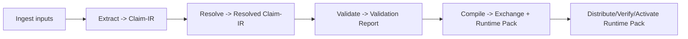

# Kristal Artifacts

**Normative for kOA:** NO
**External normative reference:** Kristal v4 (pinned)

Kristal artifacts are the **contract boundary** where “truth” becomes canonical and where offline runtime behavior is packaged for distribution. In kOA, these artifacts are **normatively defined by Kristal v4**; kOA documents only how they are used, gated, verified, and referenced. 

## Non-redundancy rule

kOA **must not** duplicate Kristal schemas, field lists, canonicalization rules, or signature formats in this wiki. Instead, point to the pinned Kristal dependency and its schema/spec paths.  

## Where Kristal artifacts sit in the lifecycle

High-level stage ordering reference: 

## The core Kristal artifacts used by kOA

| Artifact                               | What it is (plain terms)                                             | Typical producer in kOA | Primary consumer in kOA             |
| -------------------------------------- | -------------------------------------------------------------------- | ----------------------- | ----------------------------------- |
| **Claim-IR**                           | Proposed structured claims extracted from inputs                     | Extractors              | SenTient + Validation               |
| **Resolved Claim-IR**                  | Claims after entity/property/literal resolution (ambiguity explicit) | SenTient                | Validation + Compilation            |
| **Validation Report**                  | Deterministic accept/reject decision + reasons                       | Validator               | Orgo gate (“no compile on fail”)    |
| **Exchange (commit + manifest)**       | Canonical truth boundary (what is “canon”)                           | Kristal compiler        | Query / Render / Export             |
| **Runtime Pack (manifest + payloads)** | Offline execution boundary (what gets activated at the edge)         | Kristal compiler        | Konnaxion verify/activate/rollback  |

## How kOA uses these artifacts (without schema details)

### 1) Validate before “truth” (hard gate)

* The Validation Report is produced deterministically and is used to authorize compilation.
* If validation fails, compilation must not proceed (“no compile on fail”). 

### 2) Compile into canon + offline runtime

* Compilation produces **Exchange** (canon) and **Runtime Pack** (offline runtime form). 

### 3) Verify before activation (fail-closed)

Before a Runtime Pack can become active, kOA requires **verify-before-activate** and **fail-closed** behavior (schema validity, integrity, compatibility), with **atomic activation** and deterministic rollback to last-known-good. 

## What kOA records about Kristal artifacts

kOA operational artifacts (Build/Release records, Cases/Tasks) must store Kristal artifacts as **opaque references** (IDs + manifest refs / hashes), without assuming Kristal internal structure.  

## Where to find the actual Kristal contracts

Use these kOA integration docs as the single pointer set:

* **Pinned dependency (how the Kristal version is pinned, and how to reference schema paths):** `40-integration/kristal-v4/pinned-dependency.md` 
* **Contract pointers (exact Kristal schema paths for each artifact):** `40-integration/kristal-v4/contract-pointers.md` 
* **Conformance (the gates and checks required in CI/runtime):** `40-integration/kristal-v4/conformance.md` 

## Related pages

* `Artifacts-Operational` (kOA-native artifacts) 
* `Integration-Kristal-v4` (integration invariant and quick start) 
